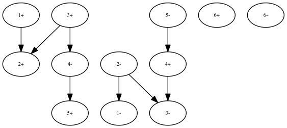
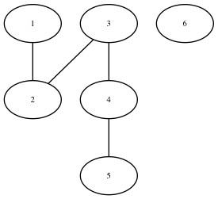

[](https://codeclimate.com/github/lmrodriguezr/gfa)

# Graphical Fragment Assembly (GFA) for Ruby

This implementation follows the specifications of [GFA-spec][].


## Parsing GFA

To parse a file in GFA format:
```ruby
require "gfa"

my_gfa = GFA.load("assembly.gfa")
```

To load GFA strings line-by-line:
```ruby
require "gfa"

my_gfa = GFA.new
fh = File.open("assembly.gfa", "r")
fh.each do |ln|
   my_gfa << ln
end
fh.close
```

## Saving GFA

After altering a GFA object, you can simply save it in a file as:
```ruby
my_gfa.save("alt-assembly.gfa")
```

Or line-by-line as:
```ruby
fh = File.open("alt-assembly.gfa", "w")
my_gfa.each_line do |ln|
   fh.puts ln
end
fh.close
```

## Visualizing GFA

Any `GFA` object can be exported as an [`RGL`][rgl] graph using the methods
`adjacency_graph` and `implicit_graph`. For example, you can render
[tiny.gfa](data/tiny.gfa):
```ruby
require "gfa"
require "rgl/dot"

my_gfa = GFA.load("data/tiny.gfa")
dg = my_gfa.implicit_graph
dg.write_to_graphic_file('jpg')
```


If you don't care about orientation, you can also build an undirected graph
without orientation:
```ruby
ug = my_gfa.implicit_graph(orient:false)
ug.write_to_graphic_file('jpg')
```



# Author

[Luis M. Rodriguez-R][lrr].

# License

[Artistic License 2.0](LICENSE).

[GFA-spec]: https://github.com/pmelsted/GFA-spec
[lrr]: http://lmrodriguezr.github.io/
[rgl]: https://github.com/monora/rgl
